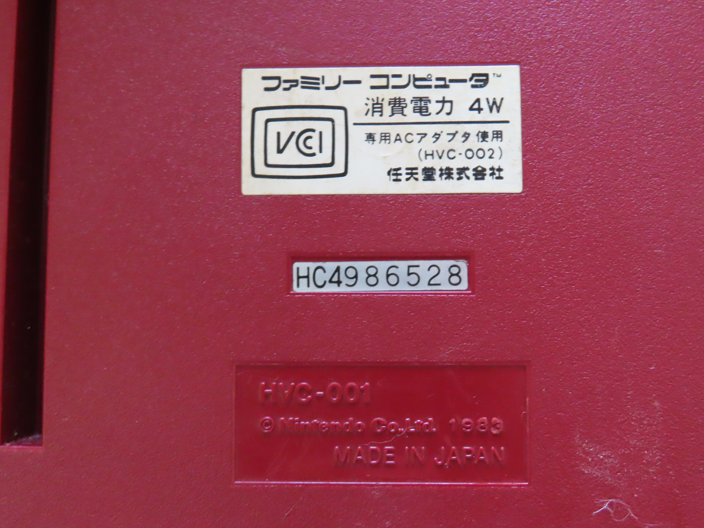
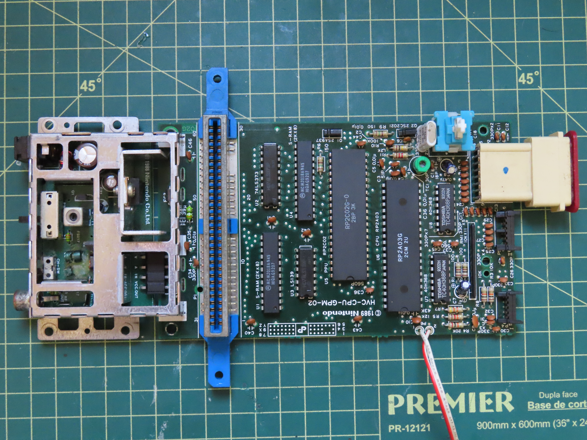
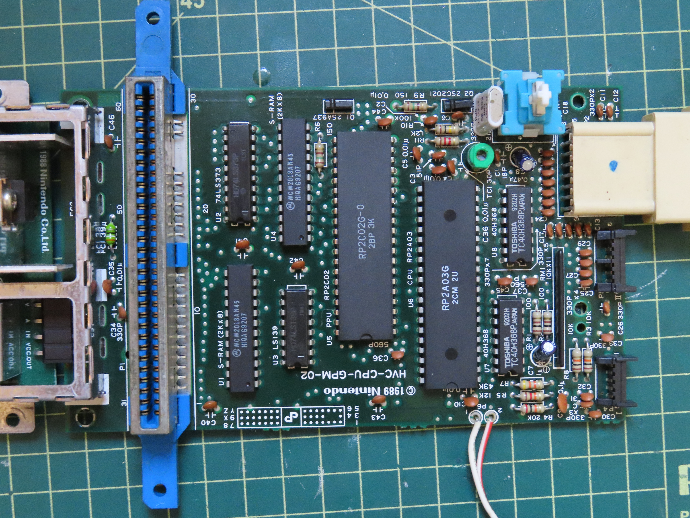
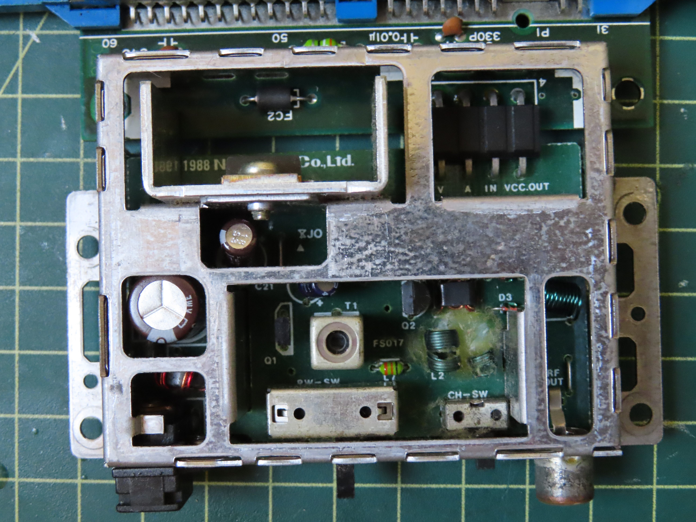
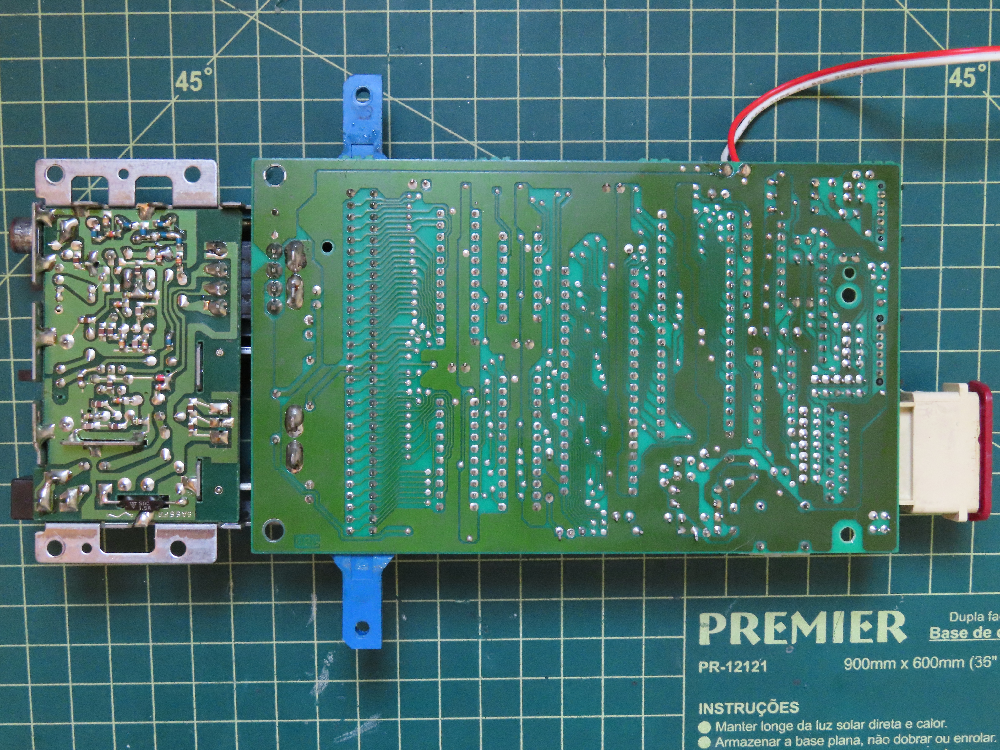
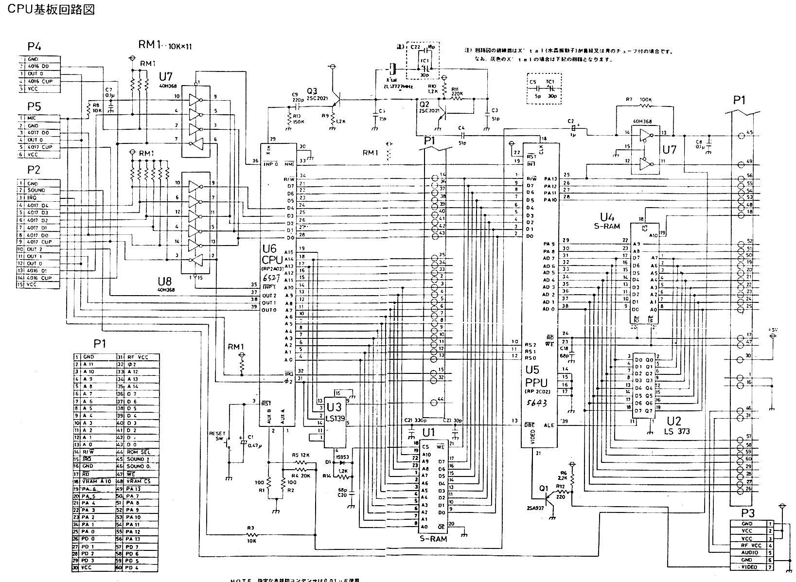

# Famicom (Famicom Family)

## Modelo HVC-CPU-GPM-02
### Imagens

## Esquema do circuito

### Lista de capacitores
| Marcação   | Capacitancia | Voltagem | Tipo   | Notas        |
|------------|--------------|----------|--------|--------------|
| C1         | 10µF         | 50v      | Radial | Há relatos de que 16v serve |
| C2         | 1µF	        | 50v      | Radial |              |
| C7         | 1µF	        | 50v      | Radial |              |
| C8         | 0.47µF       | 50v      | Radial |              |
| C21        | 47µF         | 16v      | Radial |              |
| C22        | 1000µF       | 6.3v     | Radial |              |
| Controle 2 | 0.33µF       | 50v      | Radial |              |

#### Onde comprar (todos radiais)
| Quantidade | Capacitancia | Voltagem | Link |
|------------|--------------|----------|------|
| 1          | 10µF         | 50v      | [Mult Comercial](https://www.multcomercial.com.br/capacitor-eletrolitico-de-10uf-16v-a-450v.html) |
| 2          | 1µF          | 50v      | [Mult Comercial](https://www.multcomercial.com.br/capacitor-eletrolitico-de-1uf-50v-a-450v.html) |
| 1          | 0.47µF       | 50v      | [Mult Comercial](https://www.multcomercial.com.br/capacitor-eletrolitico-de-0-47uf-50v-a-100v.html) | 
| 1          | 47µF         | 16v      | [Mult Comercial](https://www.multcomercial.com.br/capacitor-eletrolitico-de-47uf-16v-a-450v.html) |
| 1          | 1000µF       | 6.3V     | [Mult Comercial](https://www.multcomercial.com.br/capacitor-eletrolitico-de-1000uf-6-3v-a-250v.html) |
| 1          | 0.33µF       | 50v      | [Mult Comercial](https://www.multcomercial.com.br/capacitor-eletrolitico-0-33uf-63v.html) |

