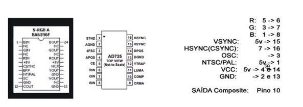

# Substituição do enconder de vídeo do Super Nintendo/Super Famicom (D.I.Y.)

Recomendo acessar o vídeo completo sobre o assunto:
<iframe width="560" height="315" src="https://www.youtube.com/embed/L9sGYfnSooU?si=XDcmY5eXk6BUHqjf" title="YouTube video player" frameborder="0" allow="accelerometer; autoplay; clipboard-write; encrypted-media; gyroscope; picture-in-picture; web-share" referrerpolicy="strict-origin-when-cross-origin" allowfullscreen></iframe>

A idéia aqui é tentar transcrever como foi feito a modificação

## Lista de compras
* CI AD-725AR (ou AD725 ou AD-725ARZ)
* OSCILADOR 14,31818mhz
* Placa de Circuito Impresso
* Percloreto de Ferro

## Imagens
### Encoder do SNES

### Encoder Novo

### Proposta do circuito

## Notas
* Talvez seja necessário colocar um capacitor ceramico de 0.1µF na entrada de vídeo (um para cada entrada)
* Tente usar fios mais curto possível