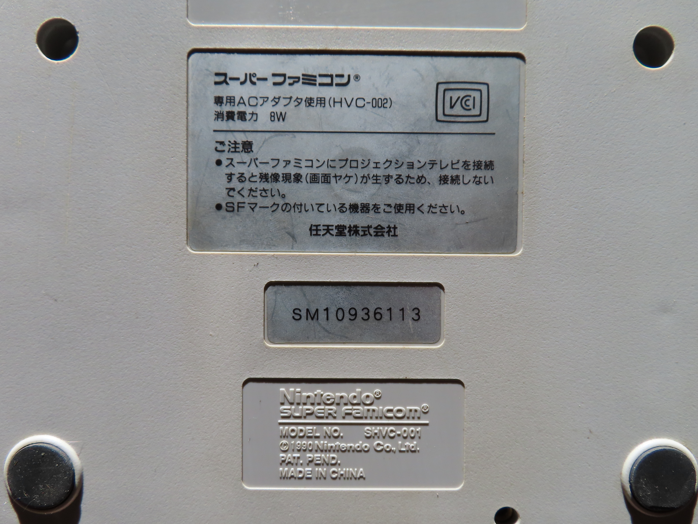
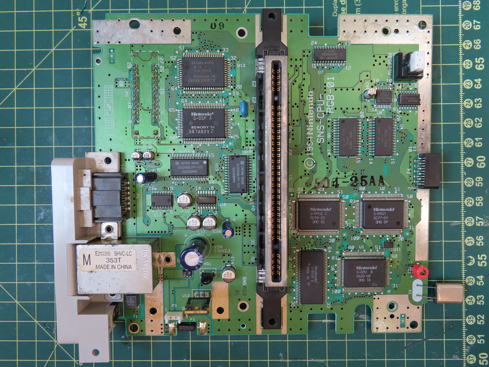
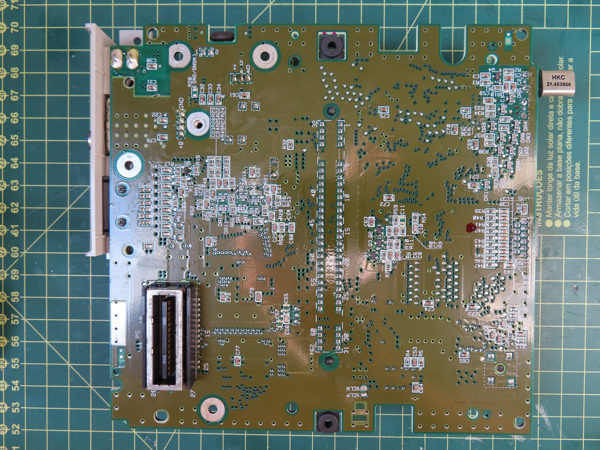
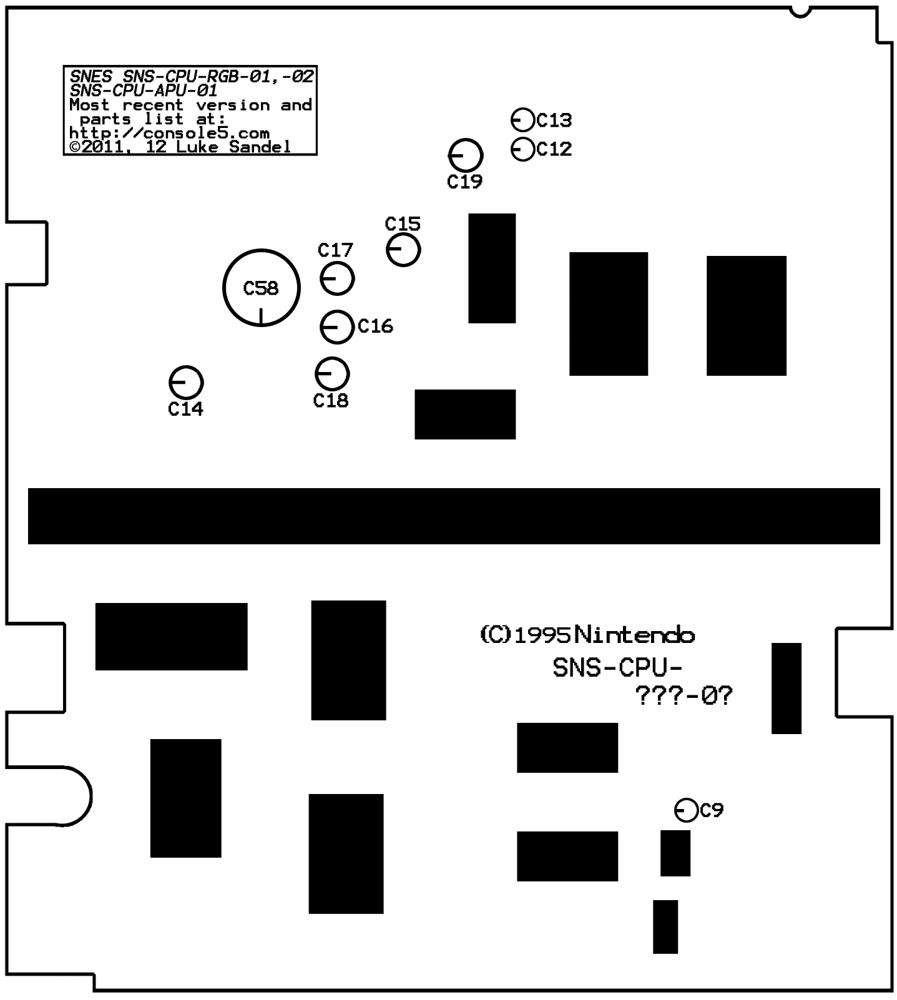

# Super Famicom

## Esquema do circuito
[Arquivo PDF](img/Esquema_PCB.pdf)
[Arquivo PDF Console PAL](img/Esquema_PCB-PAL.pdf) - Para referência do S-MIX


## Modelo SNS-CPU-RGB-01
### Imagens




### Mapa dos capacitores (com polaridade)


### Lista de capacitores
| Marcação | Inscrição   | Capacitancia | Voltagem | Tipo   | Notas        |
|----------|-------------|--------------|----------|--------|--------------|
| C9       | 2.2/50A/450 | 2.2µf        | 50v      | SMT    |              |
| C12      | 10/16A/4NS  | 10µf         | 16v      | SMT    |              |
| C13      | 10/16A/4NS  | 10µf         | 16v      | SMT    |              |
| C14      | 33/25A/4DD  | 33µf         | 25v      | SMT    |              |
| C15      | 47/16A/4DN  | 47µf         | 16v      | SMT    |              |
| C16      | 33/25A/4DD  | 33µf         | 25v      | SMT    |              |
| C17      | 33/25A/4DD  | 33µf         | 25v      | SMT    |              |
| C18      | 220µF/6,3v  | 220µf        | 6.3v     | Radial |              |
| C19      | 220µF/6,3v  | 220µf        | 6.3v     | Radial |              |
| C58      | 1000µF/25v  | 1000µf       | 25v      | Radial |              |

#### Onde comprar (todos radiais)
| Capacitancia | Voltagem | Link |
|--------------|----------|------|
| 10µF         | 16V      | [Mult Comercial](https://www.multcomercial.com.br/capacitor-eletrolitico-de-10uf-16v-a-450v.html) |
| 33µF         | 25V      | [Mult Comercial](https://www.multcomercial.com.br/capacitor-eletrolitico-de-33uf-16v-a-450v.html) |
| 220µF        | 6,3V     | [Mult Comercial](https://www.multcomercial.com.br/capacitor-eletrolitico-de-220uf-16v-a-450v.html) | 
| 2.2µF        | 50V      | [Mult Comercial](https://www.multcomercial.com.br/capacitor-eletrolitico-de-2-2uf-50v-a-400v.html) |
| 1000µF       | 25V      | [Mult Comercial](https://www.multcomercial.com.br/capacitor-eletrolitico-de-1000uf-6-3v-a-250v.html) |
| 47µF         | 16V      | [Mult Comercial](https://www.multcomercial.com.br/capacitor-eletrolitico-de-47uf-16v-a-450v.html) |

### Notas
* O console usa o chip S-MIX, e não um LM324. Com isso ele só é trocável por outro S-MIX, sendo necessário placas sucatas doadoras. É necessário adaptar o entendimento um pouco. 
* Um ponto importante é que ele funciona com 12v, é bem comum dar problema de chip queimado devido a sobrecarga de energia.

```
S-MIX PINOUT
              .---\/---.
      VCC -- | 01  14 | <- PREL
     PRER -> | 02  13 | <- MUTE
    IN_AR -> | 03  12 | <- IN_AL
    IN_ER -> | 04  11 | <- IN_EL
    IN_CR -> | 05  10 | <- IN_CL
      GND -- | 06  09 | -- GND
Right Out <- | 07  08 | -> Left Out
             `--------´
```

PRER: Right Preset<br/>
PREL: Left Preset<br/>
IN_AL/R: Audio da APU<br/>
IN_EL/R: Audio da Expansion Port<br/>
IN_CL/R: Audio do Cartucho<br/>

---
