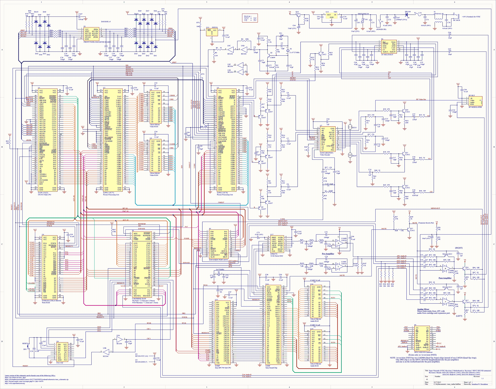

# Super Nintendo

## Modelo SNS-CPU-GPM-02
### Imagens

### Lista de capacitores
| Marcação | Inscrição   | Capacitancia | Voltagem | Tipo   | Notas        |
|----------|-------------|--------------|----------|--------|--------------|
| C57      | 220µF/6,3v  | 220µF        | 6,3V     | Radial |              |
| C62      | 2.2/50A/37C | 2.2µF        | 50V      | SMT    |              |
| C59      | 220µF/6,3v  | 220µF        | 6,3V     | Radial |              |
| C65      | 10/16A/37H  | 10µF         | 16V      | SMT    |              |
| C66      | 10/16A/37H  | 10µF         | 16V      | SMT    |              |
| C61      | 10/16A/37H  | 10µF         | 16V      | SMT    |              |
| C63      | 33/25A/37G  | 33µF         | 25V      | SMT    |              |
| C64      | 33/25A/37G  | 33µF         | 25V      | SMT    |              |
| C73      | 47/16A/37C  | 47µF         | 16V      | SMT    |              |
| C67      | N/A         | 1000µF       | 25V      | Radial | Não populado |

#### Onde comprar (todos radiais)
| Capacitancia | Voltagem | Link |
|--------------|----------|------|
| 10µF         | 16V      | [link](https://www.multcomercial.com.br/capacitor-eletrolitico-de-10uf-16v-a-450v.html) |
| 33µF         | 25V      | [link](https://www.multcomercial.com.br/capacitor-eletrolitico-de-33uf-16v-a-450v.html) |
| 220µF        | 6,3V     | [link](https://www.multcomercial.com.br/capacitor-eletrolitico-de-220uf-16v-a-450v.html) | 
| 2.2µF        | 50V      | [link](https://www.multcomercial.com.br/capacitor-eletrolitico-de-2-2uf-50v-a-400v.html) |
| 1000µF       | 25V      | [link](https://www.multcomercial.com.br/capacitor-eletrolitico-de-1000uf-6-3v-a-250v.html) |
| 47µF         | 16V      | [link](https://www.multcomercial.com.br/capacitor-eletrolitico-de-47uf-16v-a-450v.html) |

Ao comprar, pegar de mesma voltagem ou maior. A Capacitancia sempre deve ser igual

### Mapa dos capacitores (com polaridade)

### Esquema do circuito

