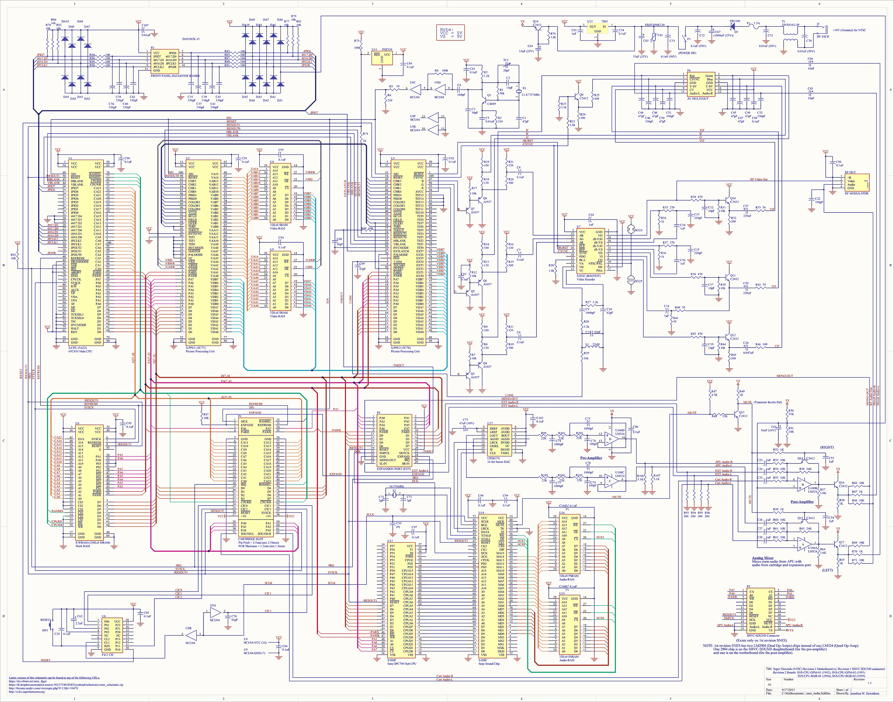
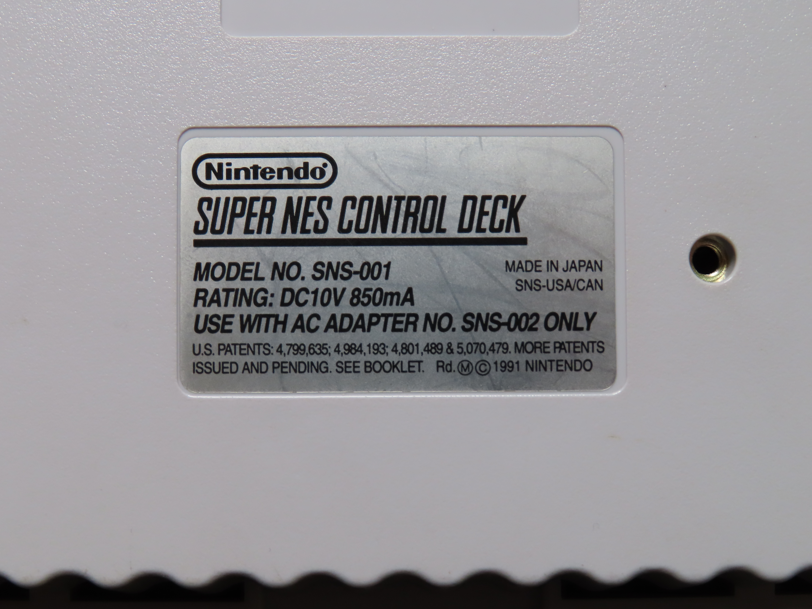
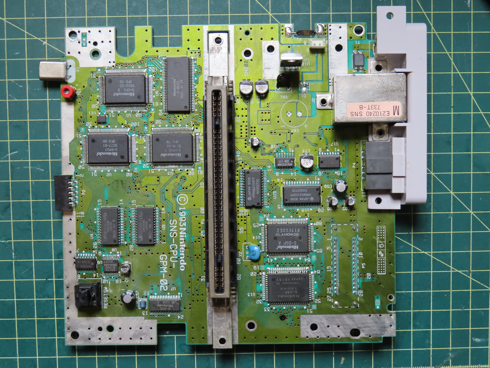
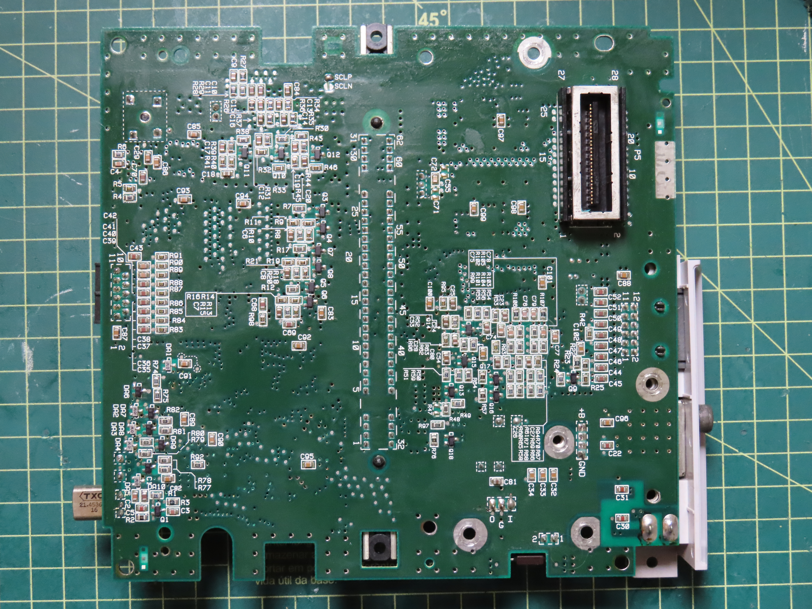
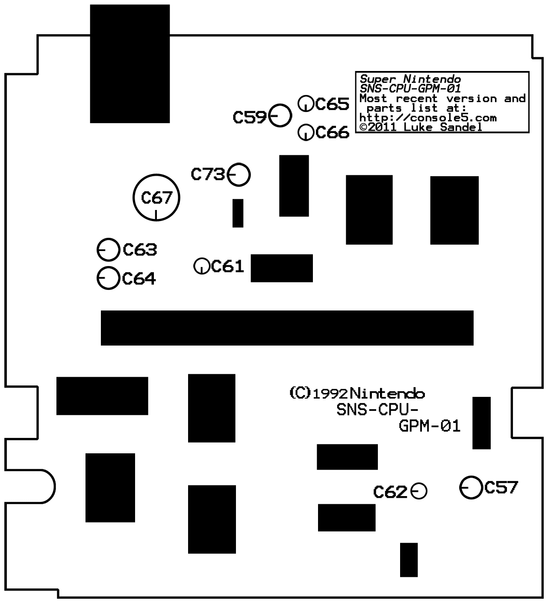

# Super Nintendo

## Esquema do circuito
[Arquivo PDF](img/Esquema_PCB.pdf)

## Modelo SNS-CPU-GPM-02
### Imagens

### Mapa dos capacitores (com polaridade)

### Lista de capacitores
| Marcação | Inscrição   | Capacitancia | Voltagem | Tipo   | Notas        |
|----------|-------------|--------------|----------|--------|--------------|
| C57      | 220µF/6,3v  | 220µF        | 6,3V     | Radial |              |
| C62      | 2.2/50A/37C | 2.2µF        | 50V      | SMT    |              |
| C59      | 220µF/6,3v  | 220µF        | 6,3V     | Radial |              |
| C65      | 10/16A/37H  | 10µF         | 16V      | SMT    |              |
| C66      | 10/16A/37H  | 10µF         | 16V      | SMT    |              |
| C61      | 10/16A/37H  | 10µF         | 16V      | SMT    |              |
| C63      | 33/25A/37G  | 33µF         | 25V      | SMT    |              |
| C64      | 33/25A/37G  | 33µF         | 25V      | SMT    |              |
| C73      | 47/16A/37C  | 47µF         | 16V      | SMT    |              |
| C67      | N/A         | 1000µF       | 25V      | Radial | Não populado |

#### Onde comprar (todos radiais)
| Capacitancia | Voltagem | Link |
|--------------|----------|------|
| 10µF         | 16V      | [Mult Comercial](https://www.multcomercial.com.br/capacitor-eletrolitico-de-10µf-16v-a-450v.html) |
| 33µF         | 25V      | [Mult Comercial](https://www.multcomercial.com.br/capacitor-eletrolitico-de-33µf-16v-a-450v.html) |
| 220µF        | 6,3V     | [Mult Comercial](https://www.multcomercial.com.br/capacitor-eletrolitico-de-220µf-16v-a-450v.html) | 
| 2.2µF        | 50V      | [Mult Comercial](https://www.multcomercial.com.br/capacitor-eletrolitico-de-2-2µf-50v-a-400v.html) |
| 1000µF       | 25V      | [Mult Comercial](https://www.multcomercial.com.br/capacitor-eletrolitico-de-1000µf-6-3v-a-250v.html) |
| 47µF         | 16V      | [Mult Comercial](https://www.multcomercial.com.br/capacitor-eletrolitico-de-47µf-16v-a-450v.html) |

Ao comprar, pegar de mesma voltagem ou maior. A Capacitancia sempre deve ser igual

#### Lista de demais componentes para reposição
| Marcação | Componente | Link        |
|----------|------------|-------------|
| U10      | LM324      | [Mercado Livre](https://www.mercadolivre.com.br/10-pecas-do-circuito-integrado-smd-amplificador-lm324/p/MLB39850011) |

#### Notas
* Durante a remoção do capacitor C61, acidentalmente removi o pad positivo do capacitor da placa do console. Após todo o recap, o console ficou sem som. Após algumas análises, consegui reparar, pois esse pad em especial é conectado a duas vias. Segue uma [**IMAGEM DO RESULTADO**](img/20250821-081524.jpg).

----------------------------------------

## Modelo SNS-CPU-RGB-01
### Imagens

### Mapa dos capacitores (com polaridade)

### Lista de capacitores
| Marcação | Inscrição   | Capacitancia | Voltagem | Tipo   | Notas        |
| C9       | 2.2/50A/450 | 2.2µf        | 50v      | SMT    |              |
| C12      | 10/16A/4NS  | 10µf         | 16v      | SMT    |              |
| C13      | 10/16A/4NS  | 10µf         | 16v      | SMT    |              |
| C14      | 33/25A/4DD  | 33µf         | 25v      | SMT    |              |
| C15      | 47/16A/4DN  | 47µf         | 16v      | SMT    |              |
| C16      | 33/25A/4DD  | 33µf         | 25v      | SMT    |              |
| C17      | 33/25A/4DD  | 33µf         | 25v      | SMT    |              |
| C18      | 220µF/6,3v  | 220µf        | 6.3v     | Radial |              |
| C19      | 220µF/6,3v  | 220µf        | 6.3v     | Radial |              |
| C58      | 1000µF/25v  | 1000µf       | 25v      | Radial |              |

#### Onde comprar (todos radiais)
| Capacitancia | Voltagem | Link |
|--------------|----------|------|
| 10µF         | 16V      | [Mult Comercial](https://www.multcomercial.com.br/capacitor-eletrolitico-de-10µf-16v-a-450v.html) |
| 33µF         | 25V      | [Mult Comercial](https://www.multcomercial.com.br/capacitor-eletrolitico-de-33µf-16v-a-450v.html) |
| 220µF        | 6,3V     | [Mult Comercial](https://www.multcomercial.com.br/capacitor-eletrolitico-de-220µf-16v-a-450v.html) | 
| 2.2µF        | 50V      | [Mult Comercial](https://www.multcomercial.com.br/capacitor-eletrolitico-de-2-2µf-50v-a-400v.html) |
| 1000µF       | 25V      | [Mult Comercial](https://www.multcomercial.com.br/capacitor-eletrolitico-de-1000µf-6-3v-a-250v.html) |
| 47µF         | 16V      | [Mult Comercial](https://www.multcomercial.com.br/capacitor-eletrolitico-de-47µf-16v-a-450v.html) |

