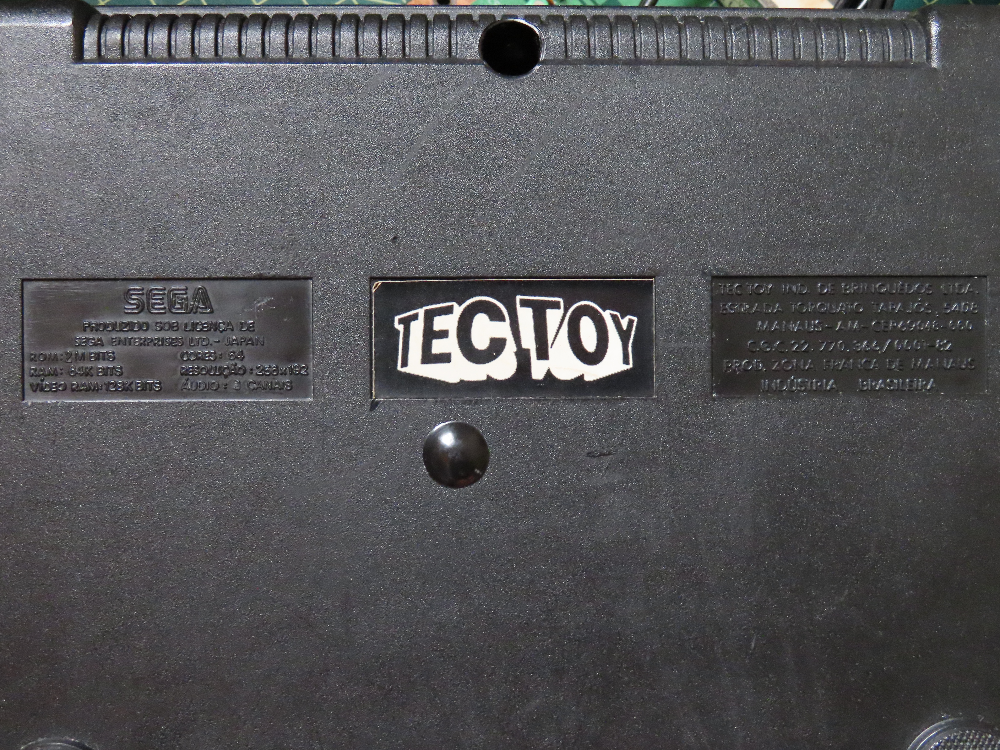
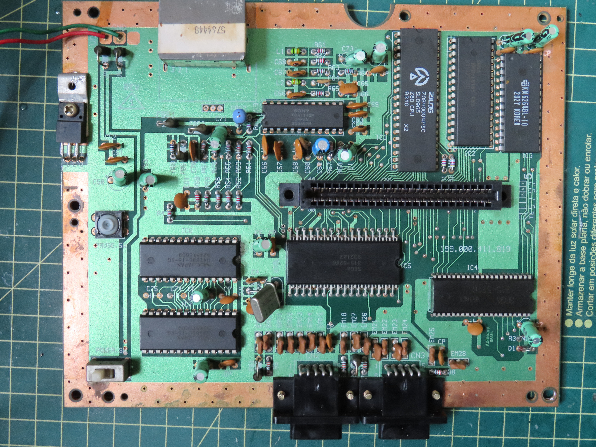
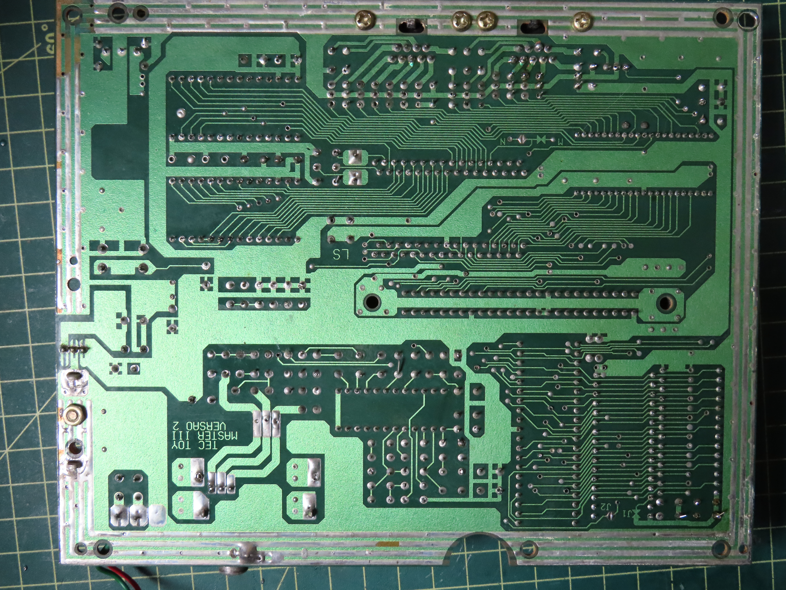

# Master System III Compact (Com Sonic 1 na memória)

## Revisão "REV 1 - TEC TOY - MASTER III VERSAO 2"
### Imagens

### Lista de capacitores (Placa Principal)
| Marcação | Inscrição   | Capacitancia | Voltagem | Tipo   | Notas |
|----------|-------------|--------------|----------|--------|-------|
| CE       | 10µF/50v    | 10µF         | 50V      | Radial | Próximo ao botão de ligar, abaixo do IC7 |
| CE       | 10µF/50v    | 10µF         | 50V      | Radial | Próximo ao botão de ligar, acima do IC7 |
| CE       | 10µF/50v    | 10µF         | 50V      | Radial | Ao lado (direita) do IC6 |
| CE       | 10µF/50v    | 10µF         | 50V      | Radial | Acima do IC3 |
| CE       | 10µF/50v    | 10µF         | 50V      | Radial | Acima do IC3 |
| CE       | 10µF/50v    | 10µF         | 50V      | Radial | Ao lado (direita) do C73 |
| C1       | 47µF/10v    | 47µF         | 10V      | Radial |       |
| C2       | 10µF/50v    | 10µF         | 50V      | Radial |       |
| C50      | 100µF/16v   | 100µF        | 16V      | Radial |       |
| C53      | 100µF/16v   | 100µF        | 16V      | Radial |       |
| C62      | 1µF/63v     | 1µF          | 63V      | Radial |       |
| C73      | 10µF/50v    | 10µF         | 50V      | Radial |       |
| C71      | 100µF/16v   | 100µF        | 16V      | Radial |       |

### Lista de capacitores (Fonte)
| Marcação | Inscrição   | Capacitancia | Voltagem | Tipo   | Notas |
|----------|-------------|--------------|----------|--------|-------|
| C02      | 2200µF/16v  | 2200µF        | 16V     | Radial |       |

#### Onde comprar (todos radiais)
| Quantidade | Capacitancia | Voltagem | Link |
|------------|--------------|----------|------|
| 8          | 10µF         | 50V      | [Mult Comercial](https://www.multcomercial.com.br/capacitor-eletrolitico-de-10uf-16v-a-450v.html)   | 
| 3          | 100µF        | 16V      | [Mult Comercial](https://www.multcomercial.com.br/capacitor-eletrolitico-de-100uf-16v-a-450v.html)  |
| 1          | 47µF         | 10V      | [Mult Comercial](https://www.multcomercial.com.br/capacitor-eletrolitico-de-47uf-16v-a-450v.html)   |
| 1          | 1µF          | 63V      | [Mult Comercial](https://www.multcomercial.com.br/capacitor-eletrolitico-de-1uf-50v-a-450v.html)    |
| 1          | 2200µF       | 16V      | [Mult Comercial](https://www.multcomercial.com.br/capacitor-eletrolitico-de-2200uf-10v-a-250v.html) |

Ao comprar, pegar de mesma voltagem ou maior. A capacitancia sempre deve ser igual.

### Lista de CIs
| Marcação | Inscrição                                                |
|----------|----------------------------------------------------------|
| IC1      | ZILOS/Z084004PSC/SL0965/Z80 CPU/9310 X2                  |
| IC2      | SEGA/MPR-15155 T62/9311XY020                             |
| IC3      | KM6264BL-10/202Y KOREA                                   |
| IC4      | SEGA/9316EY/3155216                                      |
| IC5      | SEGA/315-5246/9321K7                                     |
| IC6      | NEC JAPAN/D4168C-15-SG/9245X5009                         |
| IC7      | NEC JAPAN/D4168C-15-SG/9245X5009                         |
| IC8      | SONY/CXA1145P/JAPAN/236A9MM                              |
