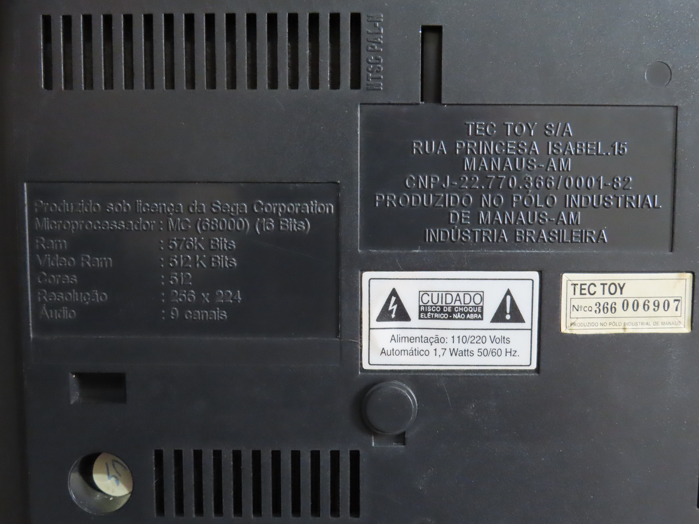
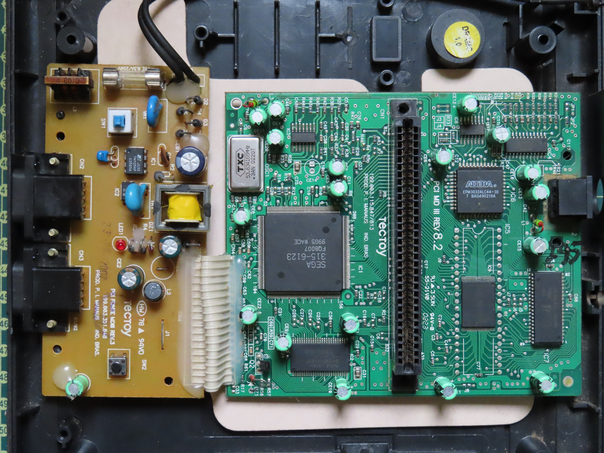
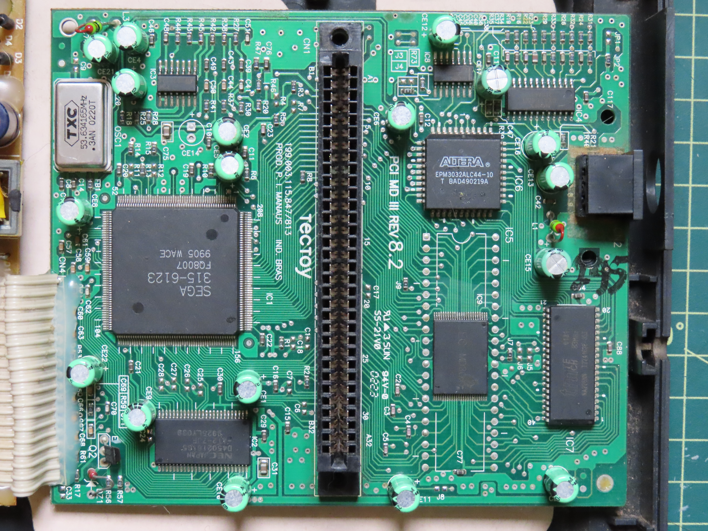
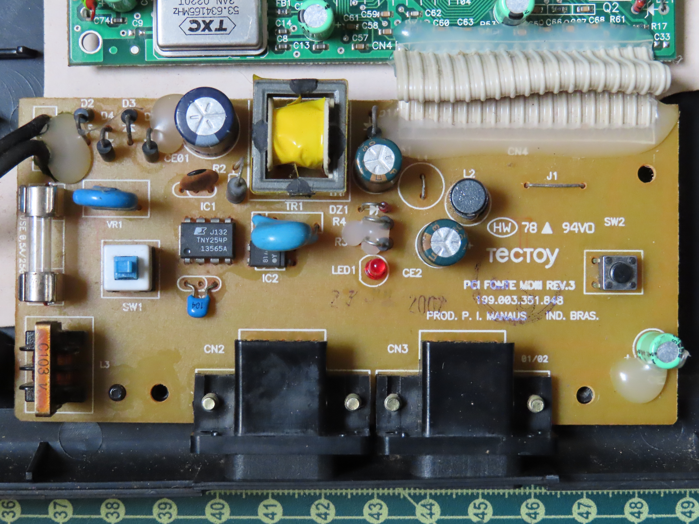
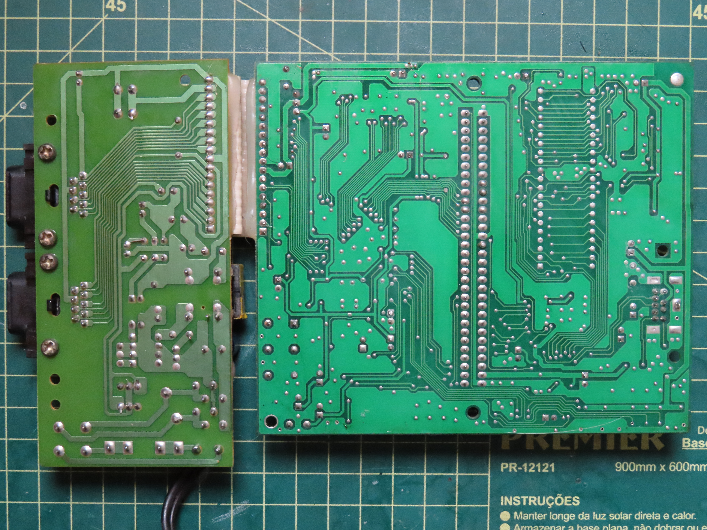

# Mega Drive III (TecToy - 30 EM 1)

## Revisão "PCI MD III REV 8.2"
### Imagens

### Lista de capacitores (Placa Principal)
| Marcação | Inscrição   | Capacitancia | Voltagem | Tipo   | Notas |
|----------|-------------|--------------|----------|--------|-------|
| CE1      | 220µF/6,3v  | 220µF        | 6,3V     | Radial |       |
| CE2      | 220µF/6,3v  | 220µF        | 6,3V     | Radial |       |
| CE4      | 220µF/6,3v  | 220µF        | 6,3V     | Radial |       |
| CE5      | 220µF/6,3v  | 220µF        | 6,3V     | Radial |       |
| CE6      | 220µF/6,3v  | 220µF        | 6,3V     | Radial |       |
| CE8      | 220µF/6,3v  | 220µF        | 6,3V     | Radial |       |
| CE9      | 220µF/6,3v  | 220µF        | 6,3V     | Radial |       |
| CE10     | 220µF/6,3v  | 220µF        | 6,3V     | Radial |       |
| CE11     | 220µF/6,3v  | 220µF        | 6,3V     | Radial |       |
| CE12     | 220µF/6,3v  | 220µF        | 6,3V     | Radial |       |
| CE13     | 220µF/6,3v  | 220µF        | 6,3V     | Radial |       |
| CE15     | 220µF/6,3v  | 220µF        | 6,3V     | Radial |       |
| CE16     | 220µF/6,3v  | 220µF        | 6,3V     | Radial |       |
| CE17     | 220µF/6,3v  | 220µF        | 6,3V     | Radial |       |
| CE18     | 220µF/6,3v  | 220µF        | 6,3V     | Radial |       |
| CE20     | 220µF/6,3v  | 220µF        | 6,3V     | Radial |       |
| CE21     | 220µF/6,3v  | 220µF        | 6,3V     | Radial |       |
| CE22     | 220µF/6,3v  | 220µF        | 6,3V     | Radial |       |

### Lista de capacitores (Fonte)
| Marcação | Inscrição   | Capacitancia | Voltagem | Tipo   | Notas |
|----------|-------------|--------------|----------|--------|-------|
| CE01     | 4,7µF/400v  | 4,7µF        | 400V     | Radial |       |
| CE1      | 330µF/16v   | 330µF        | 16V      | Radial |       |
| CE2      | 330µF/16v   | 330µF        | 16V      | Radial |       |
| CE3      | 220µF/6,3v  | 220µF        | 6,3V     | Radial |       |

#### Onde comprar (todos radiais)
| Quantidade | Capacitancia | Voltagem | Link |
|------------|--------------|----------|------|
| 19         | 220µF        | 6,3V     | [Mult Comercial](https://www.multcomercial.com.br/capacitor-eletrolitico-de-220uf-16v-a-450v.html) | 
| 2          | 330µF        | 16V      | [Mult Comercial](https://www.multcomercial.com.br/capacitor-eletrolitico-de-330uf-16v-a-450v.html) |
| 1          | 4,7µF        | 400V     | [Mult Comercial](https://www.multcomercial.com.br/capacitor-eletrolitico-de-4-7uf-50v-a-450v.html) |

Ao comprar, pegar de mesma voltagem ou maior. A capacitancia sempre deve ser igual.

### Lista de CIs (Placa Principal)
| Marcação | Inscrição                                                |
|----------|----------------------------------------------------------|
| IC1      | SEGA/315/6123/FQ8007/9905 WACE                           |
| IC2      | NEC JAPAN/D4502161G5/A F2-7JF/9925LY039                  |
| IC3      | ST/324/92L124                                            |
| IC4      | SONY/CXA1645M/216A64V                                    |
| IC5      | (Substituido pelo IC9)                                   |
| IC6      | ALTERA/EPM3032ALC44-10/T BAD490219A/VAD4938621/303TA2K0C |
| IC7      | tmtech/0131/83MHz/MA226NN/T2241628-3SJ                   |
| IC8      | 74HC00D/D8914pl/Hnn0101H                                 |
| IC9      | SEC MD30X1                                               |

*IC6 tem uma etiqueta em cima escrito DRAMC 1.0

### Lista de CIs (Fonte)
| Marcação | Inscrição           |
|----------|---------------------|
| IC1      | J132/TNY254P/13565A |
| IC2      | L0220/817B/Y        |